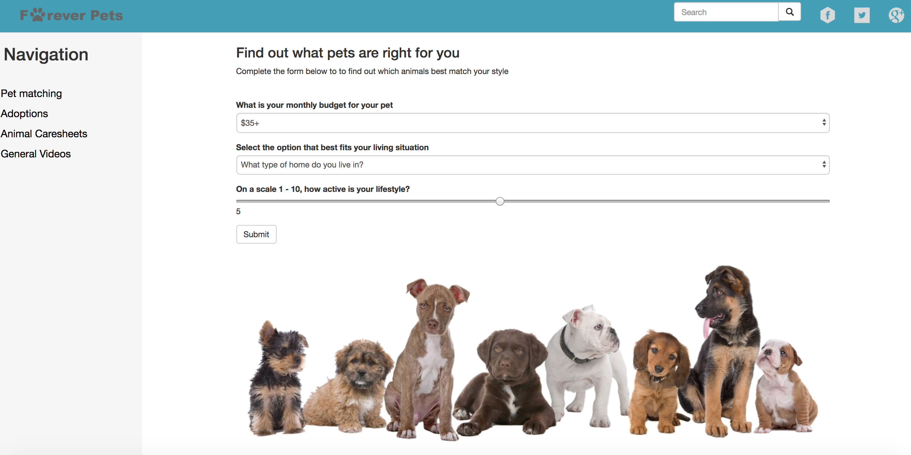
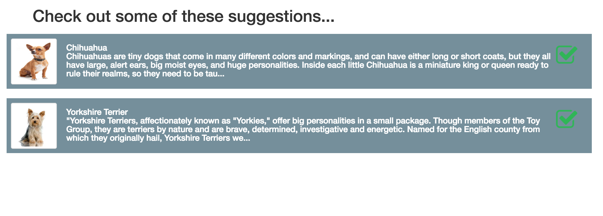
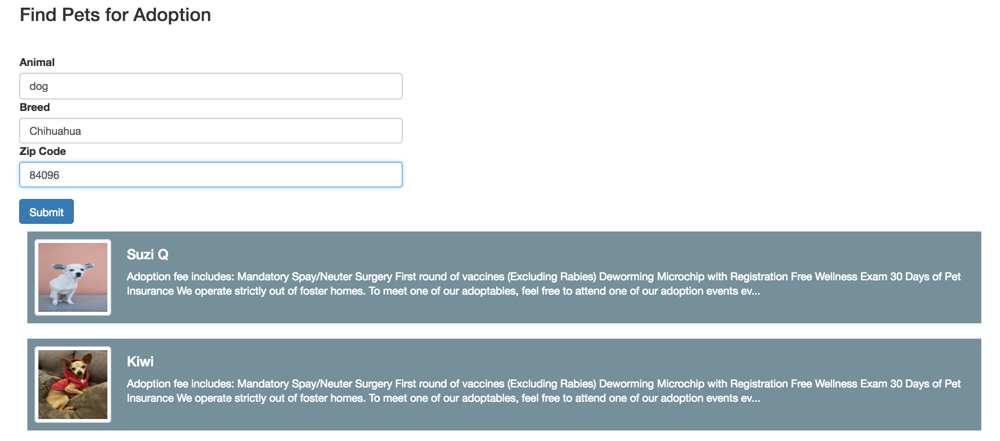

# ForeverPets 

Find the perfect pet for you! Forever Pets matches users to the right pet for them and offers them care information as well as multiple animals that can be adopted in the user’s area.

## Getting Started

To go to the Live Site go to https://cesarc770.github.io/ForverPets/
Once there you have access to a lot information. You can also take a test to find the best pet for you!

ForevePets algorithm matches you according to your activity level, what kind of housing you have and the level of income you can spend on your pet.
Once matched you can see the Care Sheets for the Pets you were matched to:

and finally you can find pets in your are available for adoption!

### Prerequisites

All you need is your browser. No install required. The project is built in firebase where most of the information is stored. 

## Built With

* Firebase - Google Database (https://firebase.google.com/)
* HTML, CSS, Bootstrap, javascript and jQuery

## Authors

* **Cesar Caceres** - *Initial work and Front End Development* 
* **Andrew Reyes-Cairo** - *Front End Development*
* **Kyle Fernelius** - *Database Administration and Development*
* **Thomas Seabury** - *API Development*

## Acknowledgments

* Hat tip to Pet Finder
* Our inspiration was seeing the need of a website like this to help people make good decisions about their pets

